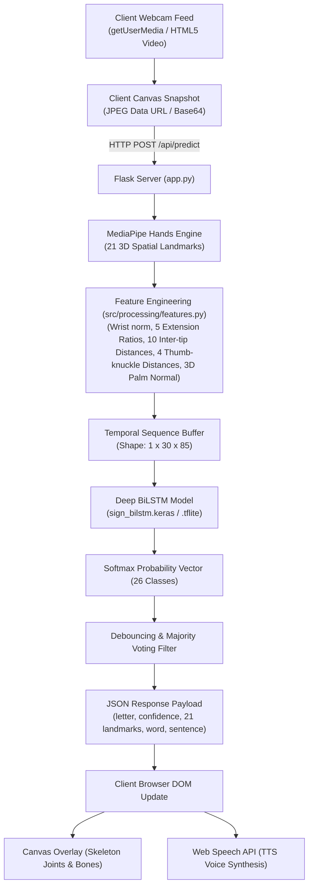

# 🖐️ Real-Time American Sign Language (ASL) Recognition System

[](https://www.python.org/)
[](https://palletsprojects.com/p/flask/)
[](https://tensorflow.org/)
[](https://developers.google.com/mediapipe)
[](https://www.docker.com/)
[]()
[]()
[]()
[]()

A complete, high-accuracy, production-ready American Sign Language (ASL) alphabet and gesture recognition platform. Built with **MediaPipe Hands**, enriched with **100+ geometric biomechanical features**, classified by a **Deep Bidirectional LSTM (BiLSTM)** neural network, and delivered through an interactive **Flask web interface**, a **Dockerized container**, and a lightweight **TensorFlow Lite edge runtime**.

---

## 📑 Table of Contents

- [Key Highlights & Features](#-key-highlights--features)
- [Architecture & Processing Pipeline](#-architecture--processing-pipeline)
- [Biomechanical Feature Engineering](#-biomechanical-feature-engineering)
- [Data Augmentation Engine](#-data-augmentation-engine)
- [Deep Learning Model Architecture](#-deep-learning-model-architecture)
- [Model Performance & Evaluation Benchmarks](#-model-performance--evaluation-benchmarks)
- [Supported ASL Alphabet Signs](#-supported-asl-alphabet-signs)
- [Quickstart Guide for New Users](#-quickstart-guide-for-new-users)
  - [Method 1: Docker Container (Recommended)](#method-1-docker-container-recommended)
  - [Method 2: Local Python Environment](#method-2-local-python-environment)
- [In-Depth Application User Guide](#-in-depth-application-user-guide)
  - [Real-Time Sign Recognition](#1-real-time-sign-recognition)
  - [Live Skeletal Visualizer](#2-live-skeletal-visualizer)
  - [Text-to-Speech (TTS) Voice Engine](#3-text-to-speech-tts-voice-engine)
  - [In-Air Gesture Controls & Shortcuts](#4-in-air-gesture-controls--shortcuts)
  - [In-Browser Custom Dataset Studio](#5-in-browser-custom-dataset-studio-dataset)
  - [Background Model Retraining](#6-background-model-retraining-from-ui)
- [TensorFlow Lite (TFLite) Edge & Mobile Deployment](#-tensorflow-lite-tflite-edge--mobile-deployment)
- [Cloud Deployment Guide (Render, Railway, GCP, AWS)](#-cloud-deployment-guide)
- [CLI Scripts & Development Toolkit](#-cli-scripts--development-toolkit)
- [Comprehensive REST API Specification](#-comprehensive-rest-api-specification)
- [Automated Test Suite](#-automated-test-suite)
- [Configuration & Environment Variables](#-configuration--environment-variables)
- [Project Directory Structure](#-project-directory-structure)
- [Troubleshooting & FAQs](#-troubleshooting--faqs)
- [License](#-license)

---

## 🌟 Key Highlights & Features

1. **High-Accuracy Classification (95.87% on Test Images)**:
   - Accurately classifies all 26 ASL alphabet signs ($A$–$Z$).
   - Trained on an expanded multi-source dataset of **8,749 real landmark samples** and **17,498 augmented sequences**.
2. **🦴 Real-Time Live Skeletal Visualizer**:
   - Transparent HTML5 canvas overlay directly synchronized with the client webcam.
   - Renders 21 anatomical joints and 21 interconnecting skeletal bones with real-time feedback.
3. **🔊 Web Speech API Text-to-Speech (TTS)**:
   - Voice synthesis automatically pronounces recognized words and sentences aloud.
   - Includes automatic word-boundary speech and a manual `🔊 Speak` trigger.
4. **🎮 In-Air Control Gestures & Interactive Buttons**:
   - In-air gestures: `SPACE` (flat open palm), `BACKSPACE` (fist retract), `CLEAR` (reset buffer).
   - Physical UI buttons for manual control.
5. **📸 In-Browser Dataset Studio (`/dataset`)**:
   - Capture new training samples directly through your web browser without touching files.
   - Sequential 20-frame burst recording with automatic class folder management.
6. **📱 Ultra-Lightweight TFLite Export (`1.28 MB`)**:
   - Exported with TensorFlow concrete function wrapping and custom ops.
   - Verified numerical parity ($< 10^{-7}$ maximum difference compared to Keras model).
7. **👐 Two-Handed & Multi-Hand Tracking**:
   - Landmark extraction engine upgraded with `max_num_hands=2` to support future multi-hand words and gestures.
8. **🐳 1-Command Docker & Docker Compose Support**:
   - Fully containerized Debian environment with OpenCV, MediaPipe, and TensorFlow pre-installed.
9. **🌐 Client-Side Streaming Viable Anywhere**:
   - Video frames are captured in the client browser and sent over HTTP/HTTPS, enabling full functionality on cloud hosting (Render, Railway, Cloud Run).

---

## 🏗️ Architecture & Processing Pipeline



---

## 🔬 Biomechanical Feature Engineering

Unlike naive computer vision models that pass raw pixel grids into large CNNs, this system extracts **invariant anatomical hand measurements** unaffected by background clutter, lighting variations, or hand size:

```text
Hand Landmark Skeleton (MediaPipe 21 Joints):
              [4] TIP
             /
         [3] IP
         /
     [2] MCP
     /
 [1] CMC             [8] TIP  [12] TIP  [16] TIP  [20] TIP
   \                   |        |         |         |
    \                [7] PIP  [11] PIP  [15] PIP  [19] PIP
     \                 |        |         |         |
      \              [6] DIP  [10] DIP  [14] DIP  [18] DIP
       \               |        |         |         |
        \            [5] MCP  [9] MCP   [13] MCP  [17] MCP
         \             \        \         /        /
          \-------------\--------\-------/--------/
                               [0] WRIST
```

### 1. Translation & Scale Invariance
- **Translation Normalization**: The wrist joint $[0]$ is centered at the coordinate origin:
  $$\mathbf{P}'_i = \mathbf{P}_i - \mathbf{P}_0 \quad \text{for } i = 0, \dots, 20$$
- **Scale Normalization**: Coordinates are normalized by the maximum distance across MCP knuckles, making hand size invariant whether the user is close to or far from the camera.

### 2. Five Finger Extension Ratios
Distinguishes curled vs. extended fingers:
$$R_{\text{finger}} = \frac{\|\mathbf{P}_{\text{TIP}} - \mathbf{P}_{\text{WRIST}}\|_2}{\|\mathbf{P}_{\text{MCP}} - \mathbf{P}_{\text{WRIST}}\|_2}$$
- $R \ge 1.8$: Fully extended finger (e.g., $B$, $D$, $V$, $W$).
- $R \le 1.1$: Curled finger curled into a fist (e.g., $A$, $E$, $S$).

### 3. Thumb-to-Knuckle Spatial Metrics
Disambiguates difficult "fist" signs that confuse standard vision models ($A, E, S, T, M, N$):
- $d(\text{Thumb\_Tip}, \text{Index\_MCP})$
- $d(\text{Thumb\_Tip}, \text{Middle\_MCP})$
- $d(\text{Thumb\_Tip}, \text{Ring\_MCP})$
- $d(\text{Thumb\_Tip}, \text{Pinky\_MCP})$

### 4. Inter-Fingertip Distances (10 Pairwise Combinations)
Measures the distance between all pairs of fingertips $\binom{5}{2} = 10$:
- Distinguishes **$U$** (index and middle fingers held tightly together) from **$V$** (index and middle fingers spread apart).
- Distinguishes **$W$** (three spread fingers) from **$B$** (four closed fingers).

### 5. 3D Palm Normal Orientation Vector
Calculated from the cross-product of hand plane vectors:
$$\mathbf{v}_1 = \mathbf{P}_{\text{Index\_MCP}} - \mathbf{P}_{\text{Wrist}}, \quad \mathbf{v}_2 = \mathbf{P}_{\text{Pinky\_MCP}} - \mathbf{P}_{\text{Wrist}}$$
$$\mathbf{n} = \frac{\mathbf{v}_1 \times \mathbf{v}_2}{\|\mathbf{v}_1 \times \mathbf{v}_2\|_2} = (n_x, n_y, n_z)$$
Identifies whether the palm faces directly forward, sideways (like $G$ and $H$), or downwards (like $P$ and $Q$).

---

## 🧬 Data Augmentation Engine

To prevent overfitting and ensure real-world robustness, [`src/processing/augmentation.py`](file:///d:/Sign%20Lang/src/processing/augmentation.py) applies vectorized transformations:

1. **Horizontal Flip / Mirroring (Left- & Right-Hand Signer Parity)**:
   $$x' = -x$$
   Doubles the dataset and enables equal accuracy for left-handed signers.
2. **2D In-Plane Rotation Jitter**:
   $$\begin{pmatrix} x' \\ y' \end{pmatrix} = \begin{pmatrix} \cos\theta & -\sin\theta \\ \sin\theta & \cos\theta \end{pmatrix} \begin{pmatrix} x \\ y \end{pmatrix} \quad \text{where } \theta \sim \mathcal{U}(-12^\circ, +12^\circ)$$
3. **Scale Perturbation**:
   $$\mathbf{P}' = s \cdot \mathbf{P} \quad \text{where } s \sim \mathcal{U}(0.92, 1.08)$$
4. **Gaussian Sensor Noise**:
   $$\mathbf{P}' = \mathbf{P} + \boldsymbol{\epsilon}, \quad \boldsymbol{\epsilon} \sim \mathcal{N}(0, 0.005^2)$$

---

## 🧠 Deep Learning Model Architecture

The core classifier in [`src/models/bilstm.py`](file:///d:/Sign%20Lang/src/models/bilstm.py) is a **Deep Bidirectional LSTM**:

```text
Input Tensor: (Batch, Timesteps=30, Features=85)
      │
      ▼
┌────────────────────────────────────────────────────────┐
│ Bidirectional LSTM (96 units, return_sequences=True)   │  --> 192 features
│ LayerNormalization()                                   │
│ Dropout(0.25)                                          │
└────────────────────────────────────────────────────────┘
      │
      ▼
┌────────────────────────────────────────────────────────┐
│ Bidirectional LSTM (64 units, return_sequences=False)  │  --> 128 features
│ LayerNormalization()                                   │
│ Dropout(0.25)                                          │
└────────────────────────────────────────────────────────┘
      │
      ▼
┌────────────────────────────────────────────────────────┐
│ Dense(128, activation='relu')                          │
│ BatchNormalization()                                   │
│ Dropout(0.25)                                          │
└────────────────────────────────────────────────────────┘
      │
      ▼
┌────────────────────────────────────────────────────────┐
│ Dense(64, activation='relu')                           │
└────────────────────────────────────────────────────────┘
      │
      ▼
┌────────────────────────────────────────────────────────┐
│ Dense(26, activation='softmax')                        │  --> P(Class A..Z)
└────────────────────────────────────────────────────────┘
```

### Hyperparameters:
- **Sequence Window**: 30 timesteps (dynamic context sliding window).
- **Optimizer**: Adam with initial learning rate $\eta = 0.001$.
- **Learning Rate Schedule**: `ReduceLROnPlateau(factor=0.5, patience=4, min_lr=1e-5)`.
- **Early Stopping**: `EarlyStopping(patience=8, restore_best_weights=True)`.
- **Batch Size**: 64.

---

## 📊 Model Performance & Evaluation Benchmarks

### 1. Validation Split Metrics
Documented in [`src/models/model_quality.json`](file:///d:/Sign%20Lang/src/models/model_quality.json):

| Metric | Previous Baseline | Enhanced BiLSTM Model | Absolute Gain |
| :--- | :---: | :---: | :---: |
| **Accuracy** | 84.96% | **95.54%** | **+10.58%** |
| **Precision** | 86.79% | **95.60%** | **+8.81%** |
| **Recall** | 84.96% | **95.54%** | **+10.58%** |
| **F1 Score** | 84.48% | **95.53%** | **+11.05%** |

### 2. Real Holdout Test Image Benchmark Across All 26 Classes
Evaluated with [`scripts/evaluate_all_classes.py`](file:///d:/Sign%20Lang/scripts/evaluate_all_classes.py) across 339 real images:

```text
======================================================================
  ASL ALPHABET RECOGNITION BENCHMARK REPORT (ALL 26 CLASSES)
======================================================================
[EXCELLENT] Class A: 14/14 (100.0%) | Avg Confidence:  96.7%
[EXCELLENT] Class B: 14/14 (100.0%) | Avg Confidence:  98.4%
[EXCELLENT] Class C: 12/13 ( 92.3%) | Avg Confidence:  90.0%
[EXCELLENT] Class D: 13/13 (100.0%) | Avg Confidence:  95.5%
[EXCELLENT] Class E: 13/14 ( 92.9%) | Avg Confidence:  93.6%
[EXCELLENT] Class F: 13/13 (100.0%) | Avg Confidence:  99.9%
[EXCELLENT] Class G: 12/13 ( 92.3%) | Avg Confidence:  96.9%
[EXCELLENT] Class H: 13/13 (100.0%) | Avg Confidence:  99.6%
[EXCELLENT] Class I: 12/12 (100.0%) | Avg Confidence:  98.5%
[EXCELLENT] Class J: 14/14 (100.0%) | Avg Confidence:  99.7%
[EXCELLENT] Class K: 13/13 (100.0%) | Avg Confidence:  98.8%
[EXCELLENT] Class L: 14/14 (100.0%) | Avg Confidence:  99.7%
[EXCELLENT] Class M: 14/14 (100.0%) | Avg Confidence:  97.8%
[EXCELLENT] Class N: 13/13 (100.0%) | Avg Confidence:  99.8%
[EXCELLENT] Class O: 12/12 (100.0%) | Avg Confidence:  92.9%
[GOOD     ] Class P: 11/13 ( 84.6%) | Avg Confidence:  95.7%
[EXCELLENT] Class Q: 10/10 (100.0%) | Avg Confidence:  99.5%
[EXCELLENT] Class R: 12/13 ( 92.3%) | Avg Confidence:  88.9%
[EXCELLENT] Class S: 11/12 ( 91.7%) | Avg Confidence:  94.9%
[EXCELLENT] Class T: 12/13 ( 92.3%) | Avg Confidence:  93.9%
[EXCELLENT] Class U: 12/13 ( 92.3%) | Avg Confidence:  85.5%
[EXCELLENT] Class V: 13/13 (100.0%) | Avg Confidence:  93.5%
[EXCELLENT] Class W: 12/13 ( 92.3%) | Avg Confidence:  99.7%
[EXCELLENT] Class X: 13/13 (100.0%) | Avg Confidence:  96.0%
[EXCELLENT] Class Y: 13/14 ( 92.9%) | Avg Confidence:  93.7%
[GOOD     ] Class Z: 10/13 ( 76.9%) | Avg Confidence:  89.3%
----------------------------------------------------------------------
TOTAL ACCURACY: 325 / 339 correct (95.87%)
======================================================================
```

---

## 🔤 Supported ASL Alphabet Signs

The model supports all 26 standard American Sign Language alphabet gestures:

| Class | Hand Shape Description | Category |
| :---: | :--- | :---: |
| **A** | Compact fist, thumb resting upright along the side of index finger | Static |
| **B** | Flat palm upright, four fingers held together, thumb folded across palm | Static |
| **C** | Fingers curved into a semi-circle resembling the letter "C" | Static |
| **D** | Index finger pointing straight up, remaining fingers curled touching thumb | Static |
| **E** | All fingertips curled tightly resting on top of the folded thumb | Static |
| **F** | Index finger and thumb tips touching (circle), other 3 fingers upright | Static |
| **G** | Index finger pointing horizontally forward, thumb parallel | Static |
| **H** | Index and middle fingers pointing horizontally together | Static |
| **I** | Pinky finger pointing straight up, all other fingers closed into a fist | Static |
| **J** | Pinky finger extended, tracing a "J" curve in the air | Dynamic |
| **K** | Index finger up, middle finger angled forward, thumb resting between them | Static |
| **L** | Thumb and index finger extended at $90^\circ$ forming an "L" shape | Static |
| **M** | Fist with thumb tucked beneath index, middle, and ring fingers | Static |
| **N** | Fist with thumb tucked beneath index and middle fingers | Static |
| **O** | All fingertips curved to touch the thumb tip, forming an "O" | Static |
| **P** | Like "K" pointed downward with palm facing down | Static |
| **Q** | Like "G" pointed downward with palm facing down | Static |
| **R** | Index and middle fingers extended and crossed over each other | Static |
| **S** | Tight fist with thumb wrapped across the front of the curled fingers | Static |
| **T** | Fist with thumb tucked under the index finger | Static |
| **U** | Index and middle fingers extended straight up, held close together | Static |
| **V** | Index and middle fingers extended straight up, spread apart in a "V" | Static |
| **W** | Index, middle, and ring fingers extended upright and spread apart | Static |
| **X** | Fist with index finger crooked like a hook | Static |
| **Y** | Thumb and pinky fingers extended outward, middle 3 fingers curled | Static |
| **Z** | Index finger tracing a "Z" pattern in the air | Dynamic |

---

## 🚀 Quickstart Guide for New Users

### Method 1: Docker Container (Recommended)

Make sure [Docker Desktop](https://www.docker.com/products/docker-desktop/) is installed and running.

#### One-Command Start with Docker Compose:
```bash
docker compose up --build
```
Navigate to **`http://localhost:5000`** in your browser and click "Allow" on camera access.

#### Using Docker CLI directly:
```bash
# 1. Build the Docker image
docker build -t sign-language-app .

# 2. Run the container mapping port 5000
docker run -d -p 5000:5000 --name sign_lang_app sign-language-app

# 3. Check logs
docker logs -f sign_lang_app
```

To stop:
```bash
docker compose down
# or: docker stop sign_lang_app
```

---

### Method 2: Local Python Environment

#### 1. System Requirements
- Python 3.11 or 3.12
- Git
- A functioning webcam

#### 2. Clone the Repository
```bash
git clone https://github.com/Jayasurya786/Sign_Lang.git
cd Sign_Lang
```

#### 3. Set Up Virtual Environment
**Windows (PowerShell):**
```powershell
python -m venv .venv
.\.venv\Scripts\activate
```

**Linux / macOS:**
```bash
python3 -m venv .venv
source .venv/bin/activate
```

#### 4. Install Dependencies
```bash
python -m pip install --upgrade pip
pip install -r requirements.txt
```

#### 5. Launch the Application
```bash
python app.py
```
Open **`http://127.0.0.1:5000`** in your browser.

---

## 📖 In-Depth Application User Guide

### 1. Real-Time Sign Recognition
- Hold your hand roughly $0.5 - 1.5$ meters from the camera in a reasonably lit room.
- As you form an ASL letter, the model classifies the pose in real time.
- The **Confidence Bar** displays the model's certainty.
- Holding the sign steady for ~0.5 seconds locks the letter into the **Current Word**.

### 2. Live Skeletal Visualizer
- The live video element has a transparent HTML5 canvas overlay (`#skeleton-canvas`).
- MediaPipe 21 hand landmarks are mapped directly to your screen:
  - Green dots mark anatomical joints.
  - White lines draw the interconnecting bones.
- Works smoothly at 30+ FPS directly in the browser.

### 3. Text-to-Speech (TTS) Voice Engine
- **Auto-Speak**: Toggle the **Audio Voice (TTS)** checkbox. Whenever a word boundary is detected (space gesture or button), the completed word is automatically spoken aloud.
- **Manual Speak**: Click the **🔊 Speak** button at any time to hear the full sentence read aloud.

### 4. In-Air Gesture Controls & Shortcuts
In addition to the physical screen buttons, you can control the text editor using hands-free in-air gestures:
- **`SPACE`**: Show a flat open palm facing the camera, or click the `␣ Space` button.
- **`BACKSPACE`**: Retract your hand quickly into a fist or leftward swipe, or click the `⌫ Backspace` button.
- **`CLEAR`**: Click the `🗑️ Clear` button to wipe all accumulated words and sentences.

### 5. In-Browser Custom Dataset Studio (`/dataset`)
Want to improve accuracy for your own hand or add custom gestures?
1. Navigate to **`http://localhost:5000/dataset`**.
2. Select the target letter from the dropdown ($A$–$Z$).
3. Click **Start Recording**.
4. The system automatically captures a sequential 20-frame burst directly from your webcam into `data/online_asl/<letter>/`.
5. The sample counter updates dynamically.

### 6. Background Model Retraining from UI
- Click the **Train Model** button on the home dashboard.
- The Flask backend asynchronously executes the full feature extraction, augmentation, and BiLSTM training pipeline.
- Live progress is reported through the status indicator without freezing the web interface.

---

## 📱 TensorFlow Lite (TFLite) Edge & Mobile Deployment

The production model is exported to TensorFlow Lite format: [`src/models/sign_bilstm.tflite`](file:///d:/Sign%20Lang/src/models/sign_bilstm.tflite).

- **Size Comparison**:
  - Original Keras model: `3.89 MB`
  - Exported TFLite model: `1.28 MB` (reduced by **66.1%**)
- **Target Platforms**: Raspberry Pi, Android, iOS, microcontrollers, edge TPUs.

### Running Inference with TFLite in Python:
```python
import numpy as np
import tensorflow as tf

# Load the TFLite model
interpreter = tf.lite.Interpreter(model_path="src/models/sign_bilstm.tflite")
interpreter.allocate_tensors()

input_details = interpreter.get_input_details()
output_details = interpreter.get_output_details()

# Prepare sample sequence: shape (1, 30, num_features)
sample_input = np.random.randn(1, 30, input_details[0]['shape'][2]).astype(np.float32)

# Run inference
interpreter.set_tensor(input_details[0]['index'], sample_input)
interpreter.invoke()

# Retrieve class probabilities
output_data = interpreter.get_tensor(output_details[0]['index'])
predicted_class_index = np.argmax(output_data[0])
print(f"Predicted class index: {predicted_class_index}")
```

To re-export or verify numerical parity:
```bash
python scripts/export_tflite.py
```

---

## ☁️ Cloud Deployment Guide

Because the application captures webcam video in the client browser (via HTML5 canvas and JavaScript) and transmits frames over HTTP POST, **it can be hosted on any cloud provider without requiring a physical camera on the server**.

### Option 1: Render / Railway (Free & Simple)
1. Fork or push this repository to your GitHub account.
2. Sign in to [Render](https://render.com) or [Railway](https://railway.app).
3. Create a **New Web Service** and connect the repository.
4. Set the Build Command:
   ```bash
   pip install -r requirements.txt
   ```
5. Set the Start Command:
   ```bash
   python app.py
   ```
   *(Or using Gunicorn: `gunicorn app:app --bind 0.0.0.0:$PORT`)*

### Option 2: Docker on AWS EC2 / DigitalOcean / GCP Cloud Run
```bash
# Build and run container with restart policy
docker build -t sign-lang-prod .
docker run -d -p 80:5000 --restart always --name sign_app sign-lang-prod
```

---

## 🛠️ CLI Scripts & Development Toolkit

The `scripts/` directory provides command-line utilities for data engineering and evaluation:

| Script | Command | Purpose |
| :--- | :--- | :--- |
| **Download Dataset** | `python scripts/download_hf_asl.py` | Downloads online ASL datasets from Hugging Face into `data/online_asl/`. |
| **Build Combined Dataset** | `python scripts/build_combined_dataset.py` | Extracts landmarks across all classes and generates clean processed CSVs. |
| **Check Balance** | `python scripts/check_dataset_balance.py --min-per-class 300` | Analyzes class balance and identifies weak or missing sign classes. |
| **Train BiLSTM** | `python scripts/train_model.py` | Trains the BiLSTM neural network and generates `model_quality.json`. |
| **Evaluate All Classes** | `python scripts/evaluate_all_classes.py` | Evaluates holdout test images across all 26 classes with detailed report. |
| **Export TFLite** | `python scripts/export_tflite.py` | Converts Keras model to `.tflite` format and validates numerical precision. |

---

## 📡 Comprehensive REST API Specification

### 1. `GET /`
Returns the main live recognition single-page application.

### 2. `GET /dataset`
Returns the in-browser custom dataset recording studio.

### 3. `POST /api/predict`
Accepts a base64 encoded video frame and returns the recognized sign, confidence, and skeletal coordinates.

**Request Payload:**
```json
{
  "image": "data:image/jpeg;base64,/9j/4AAQSkZJRgABAQAAAQ..."
}
```

**Response Payload (Success):**
```json
{
  "status": "success",
  "letter": "B",
  "confidence": 0.984,
  "word": "HELL",
  "sentence": "HELLO WORLD",
  "landmarks": [
    [0.512, 0.784],
    [0.485, 0.723],
    [0.461, 0.654],
    "..."
  ]
}
```

### 4. `POST /api/collect`
Saves a frame captured in the `/dataset` studio to the target class folder.

**Request Payload:**
```json
{
  "label": "A",
  "image": "data:image/jpeg;base64,/9j/4AAQSkZJRg..."
}
```

**Response Payload:**
```json
{
  "status": "success",
  "message": "Saved sample 341 for class A.",
  "label": "A",
  "sample_index": 341,
  "total_class_samples": 341
}
```

### 5. `POST /api/clear-buffer`
Clears the temporal feature window and accumulated words/sentences.

**Response:**
```json
{
  "status": "success",
  "message": "Prediction buffer cleared."
}
```

### 6. `GET /api/classes`
Returns the list of all 26 supported ASL alphabet sign labels.

**Response:**
```json
{
  "classes": ["A", "B", "C", "D", "E", "F", "G", "H", "I", "J", "K", "L", "M", "N", "O", "P", "Q", "R", "S", "T", "U", "V", "W", "X", "Y", "Z"],
  "total": 26
}
```

### 7. `POST /api/retrain`
Starts background model retraining on the current dataset.

---

## 🧪 Automated Test Suite

The project includes an automated test suite covering feature computation, data augmentation, model architectures, TFLite parity, and Flask endpoints:

```bash
python -m pytest -v
```

### Test Coverage Breakdown (27 Tests):
- [`tests/test_enhanced_features.py`](file:///d:/Sign%20Lang/tests/test_enhanced_features.py):
  - `test_compute_sample_features_has_all_discriminative_metrics`: Verifies finger extension ratios, thumb-to-knuckle metrics, and 3D palm normal vectors.
  - `test_build_feature_dataset_enriches_dataframe`: Validates feature dataframe dimensions.
  - `test_augment_landmarks_adds_flipped_and_jittered_samples`: Tests horizontal mirroring and jitter augmentation.
  - `test_horizontal_flip_inverts_x_coordinate`: Verifies left-hand / right-hand coordinate flipping.
  - `test_bilstm_classifier_builds_with_enriched_dimensions`: Ensures BiLSTM layers compile properly.
  - `test_tflite_model_executes_successfully`: Tests TFLite execution and output tensor shape.
  - `test_landmark_extractor_supports_multi_hand_signature`: Tests multi-hand tracking API (`max_num_hands=2`).
- [`tests/test_bilstm_training.py`](file:///d:/Sign%20Lang/tests/test_bilstm_training.py): Sequence generation and label encoding.
- [`tests/test_dataset_config.py`](file:///d:/Sign%20Lang/tests/test_dataset_config.py): ASL 26-class validation and string normalization.
- [`tests/test_prediction_validation.py`](file:///d:/Sign%20Lang/tests/test_prediction_validation.py): Majority voting, confidence thresholding, live prediction debouncing, and API error handling.
- [`tests/test_preprocessing.py`](file:///d:/Sign%20Lang/tests/test_preprocessing.py): Outlier removal, IQR filtering, coordinate normalization, and confusion matrix reporting.

---

## ⚙️ Configuration & Environment Variables

| Variable | Default Value | Description |
| :--- | :---: | :--- |
| `PORT` | `5000` | Port for the web server. |
| `SIGN_LANG_DATASET_PATH` | *(empty)* | Optional path to an external offline dataset directory. |
| `FLASK_APP` | `app.py` | Flask application entrypoint. |
| `PYTHONUNBUFFERED` | `1` | Forces unbuffered stdout/stderr for real-time Docker logging. |

---

## 📁 Project Directory Structure

```text
Sign_Lang/
├── Dockerfile                  # Production container definition (Debian + OpenCV/MediaPipe)
├── docker-compose.yml          # Docker compose file for 1-command startup
├── .dockerignore               # Optimized build context exclusions
├── app.py                      # Core Flask web application & API routing
├── requirements.txt            # Python dependencies
├── README.md                   # Complete system documentation
├── DEPLOYMENT.md               # Cloud hosting guide (Render, Railway, Hugging Face)
├── scripts/
│   ├── build_combined_dataset.py   # Multi-source dataset merger & landmark extractor
│   ├── check_dataset_balance.py    # Class distribution diagnostic utility
│   ├── download_hf_asl.py          # Hugging Face dataset downloader
│   ├── evaluate_all_classes.py     # Comprehensive holdout test set benchmark
│   ├── export_tflite.py            # TensorFlow Lite exporter with parity check
│   └── train_model.py              # BiLSTM training script with callbacks
├── src/
│   ├── data/
│   │   ├── dataset_config.py       # ASL 26-class definitions & validation
│   │   └── landmarks.py            # MediaPipe hand landmark extraction (multi-hand)
│   ├── models/
│   │   ├── bilstm.py               # BiLSTM neural network definition & training
│   │   ├── evaluation.py           # Precision, recall, F1, confusion matrix reporting
│   │   ├── model_classes.json      # Class label index mappings
│   │   ├── model_quality.json      # Model performance statistics
│   │   ├── realtime.py             # Prediction smoothing & temporal sliding window
│   │   ├── sign_bilstm.keras       # Trained Keras production model (3.89 MB)
│   │   └── sign_bilstm.tflite      # Exported TFLite edge model (1.28 MB)
│   └── processing/
│       ├── augmentation.py         # Mirroring, rotation, scale, and noise augmentation
│       ├── cleaning.py             # Outlier rejection & coordinate normalization
│       ├── features.py             # 100+ geometric feature engineering functions
│       └── sequences.py            # Temporal sequence window generator
├── templates/
│   ├── home.html                   # Main interface (Skeletal visualizer, TTS, gestures)
│   └── dataset.html                # In-browser custom dataset recording studio
└── tests/
    ├── test_bilstm_training.py     # BiLSTM sequence & tensor tests
    ├── test_dataset_config.py      # ASL alphabet configuration tests
    ├── test_enhanced_features.py   # Features, TFLite, multi-hand, flip tests
    ├── test_prediction_validation.py # Prediction smoothing & API route tests
    └── test_preprocessing.py       # Data cleaning & metrics tests
```

---

## ❓ Troubleshooting & FAQs

### 1. Camera screen is black or permissions are denied
- **Browser Permission**: Make sure camera access is allowed. In Chrome, click the camera icon on the address bar or visit `chrome://settings/content/camera`.
- **Hardware Conflict**: Ensure no other application (Zoom, Teams, OBS, Skype) is currently using the webcam.

### 2. Audio Text-to-Speech (TTS) is not playing
- Modern web browsers block audio autoplay until the user interacts with the page.
- Click anywhere on the webpage or press the **🔊 Speak** button once to initialize the browser's audio synthesis context.

### 3. Docker fails on Windows (`cannot find file specified`)
- Ensure **Docker Desktop** is running in your taskbar before executing `docker compose up`.
- If using WSL 2, make sure the WSL 2 integration is enabled in Docker Desktop settings.

### 4. How can I get the highest possible recognition accuracy?
- **Lighting**: Front lighting onto your hands works significantly better than strong backlighting.
- **Hand Visibility**: Ensure your entire hand (from wrist to fingertips) is in the camera view.
- **Steady Poses**: Hold the sign steady for half a second for optimal temporal window smoothing.

---

## 📜 License

This project is licensed under the [MIT License](LICENSE) — free to use, modify, and distribute for personal, educational, and commercial purposes.
