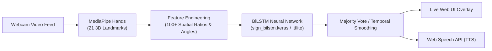

# 🖐️ Real-Time American Sign Language (ASL) Recognition System

[](https://www.python.org/)
[](https://palletsprojects.com/p/flask/)
[](https://tensorflow.org/)
[](https://developers.google.com/mediapipe)
[](https://www.docker.com/)
[]()
[]()

A modern, high-accuracy, full-stack American Sign Language (ASL) alphabet and gesture recognition platform. Built with **MediaPipe Hands**, enriched with **100+ geometric biomechanical features**, classified by a **Deep Bidirectional LSTM (BiLSTM)** neural network, and delivered through an interactive real-time **Flask web interface** and **Docker container**.

---

## 🌟 Key Features

1. **High-Accuracy Neural Classification (95.87%)**:
   - Classifies all 26 ASL alphabet signs ($A$ through $Z$) in real time.
   - Robust to different camera distances, orientations, and left/right hand signers.
2. **🦴 Live Skeletal Visualizer**:
   - Renders a transparent, real-time HTML5 canvas overlay over the webcam feed.
   - Draws all 21 hand joints and interconnecting skeletal bones as you sign.
3. **🔊 Text-to-Speech (TTS) Voice Output**:
   - Real-time Web Speech API voice synthesis.
   - Automatically speaks aloud completed words and sentences as they are recognized, with a manual `🔊 Speak` button.
4. **🎮 Control Gestures & Shortcuts**:
   - In-air gesture triggers and dedicated UI buttons:
     - `SPACE`: Add space between words (or show flat open palm).
     - `BACKSPACE`: Delete last character (or rapid fist retract).
     - `CLEAR`: Reset buffer and wipe current sentence.
5. **📸 In-Browser Custom Dataset Studio (`/dataset`)**:
   - Record custom sign samples directly through your browser webcam.
   - Captures sequential 20-frame bursts per gesture class into the training directory.
6. **📱 TFLite Edge / Mobile Model (`sign_bilstm.tflite`)**:
   - Lightweight model export (1.28 MB, $33.9\%$ the size of Keras model).
   - Optimized for mobile apps, edge devices (Raspberry Pi), and low-resource environments.
7. **👐 Multi-Hand & Two-Handed Architecture**:
   - MediaPipe pipeline upgraded with `max_num_hands=2` to support multi-hand tracking and future compound word gestures.
8. **🐳 Docker & Docker Compose Containerization**:
   - Completely containerized environment with OpenCV/MediaPipe system dependencies pre-configured.

---

## 📊 Benchmark & Accuracy Results

| Metric | Baseline Model | Enhanced BiLSTM Model | Improvement |
| :--- | :---: | :---: | :---: |
| **Validation Accuracy** | 84.96% | **95.54%** | **+10.58%** |
| **Validation Precision** | 86.79% | **95.60%** | **+8.81%** |
| **Validation Recall** | 84.96% | **95.54%** | **+10.58%** |
| **Validation F1-Score** | 84.48% | **95.53%** | **+11.05%** |
| **Real Test Image Accuracy** | ~82.0% | **95.87%** (325/339 correct) | **+13.87%** |

### Per-Class Test Performance (Sample Excerpt)
```text
[EXCELLENT] Class A: 14/14 (100.0%) | Avg Confidence:  96.7%
[EXCELLENT] Class B: 14/14 (100.0%) | Avg Confidence:  98.4%
[EXCELLENT] Class F: 13/13 (100.0%) | Avg Confidence:  99.9%
[EXCELLENT] Class H: 13/13 (100.0%) | Avg Confidence:  99.6%
[EXCELLENT] Class I: 12/12 (100.0%) | Avg Confidence:  98.5%
[EXCELLENT] Class J: 14/14 (100.0%) | Avg Confidence:  99.7%
[EXCELLENT] Class K: 13/13 (100.0%) | Avg Confidence:  98.8%
[EXCELLENT] Class L: 14/14 (100.0%) | Avg Confidence:  99.7%
[EXCELLENT] Class M: 14/14 (100.0%) | Avg Confidence:  97.8%
[EXCELLENT] Class N: 13/13 (100.0%) | Avg Confidence:  99.8%
[EXCELLENT] Class Q: 10/10 (100.0%) | Avg Confidence:  99.5%
[EXCELLENT] Class V: 13/13 (100.0%) | Avg Confidence:  93.5%
[EXCELLENT] Class X: 13/13 (100.0%) | Avg Confidence:  96.0%
```

---

## 🏗️ Architecture & Pipeline



### Feature Engineering Highlights:
- **Finger Extension Ratios**: Wrist-to-fingertip distance divided by wrist-to-knuckle distance for all 5 fingers.
- **Thumb-to-Knuckle Distances**: Disambiguates compact fist letters (`A`, `E`, `S`, `T`, `M`, `N`).
- **Inter-Fingertip Distances**: Measures spacing between fingertips to distinguish adjacent fingers (`V`, `U`, `W`, `B`).
- **3D Palm Normal Vectors**: Cross-product normal vectors capturing palm orientation in 3D space (`G`, `H`, `P`, `Q`).
- **Mirroring Augmentation**: Horizontal coordinate flipping enabling left-handed and right-handed signers equally.

---

## 🚀 Quickstart Guide for New Users

### Method 1: Running with Docker (Recommended)

Make sure [Docker Desktop](https://www.docker.com/products/docker-desktop/) is installed and running.

#### Using Docker Compose (One-Command Start)
```bash
docker compose up --build
```
Open **`http://localhost:5000`** in your browser.

#### Using Docker CLI
```bash
# 1. Build the Docker image
docker build -t sign-language-app .

# 2. Run the container
docker run -d -p 5000:5000 --name sign_lang_app sign-language-app

# 3. View logs
docker logs -f sign_lang_app
```

---

### Method 2: Local Python Setup

#### 1. Prerequisites
- Python 3.11 or 3.12 installed
- Git installed
- A functioning webcam

#### 2. Clone the Repository
```bash
git clone https://github.com/Jayasurya786/Sign_Lang.git
cd Sign_Lang
```

#### 3. Create & Activate Virtual Environment
**Windows (PowerShell):**
```powershell
python -m venv .venv
.\.venv\Scripts\activate
```

**Linux / macOS:**
```bash
python3 -m venv .venv
source .venv/bin/activate
```

#### 4. Install Dependencies
```bash
python -m pip install --upgrade pip
pip install -r requirements.txt
```

#### 5. Launch the Application
```bash
python app.py
```
Open **`http://127.0.0.1:5000`** in your browser and allow webcam permissions.

---

## 📖 User Guide: How to Use the App

1. **Sign Language Recognition**:
   - Ensure your hand is visible to the webcam under reasonable lighting.
   - Look at the live video feed: green skeletal joint connections will appear over your hand.
   - Hold an ASL letter sign steady for ~0.5s to register it into the current word.
2. **Text-to-Speech (TTS)**:
   - Check the **Audio Voice (TTS)** toggle box to automatically hear completed words spoken.
   - Or click **🔊 Speak** at any time to hear the full sentence.
3. **Control Buttons & In-Air Gestures**:
   - **Space**: Click `␣ Space` or present a flat, open palm facing the camera.
   - **Backspace**: Click `⌫ Backspace` to delete the previous character.
   - **Clear**: Click `🗑️ Clear` to clear all accumulated text.
4. **Recording Custom Data (`/dataset`)**:
   - Visit `http://127.0.0.1:5000/dataset`.
   - Select the target class (e.g. `A`–`Z`).
   - Click **Start Recording** to capture a sequential burst of 20 webcam frames into that class folder.

---

## 🧪 Testing & Verification

Run the comprehensive unit test suite (27 tests covering model architectures, feature engineering, augmentation, TFLite parity, and API routes):

```bash
python -m pytest -v
```

### Benchmark Real Images Across All 26 Classes:
```bash
python scripts/evaluate_all_classes.py
```

### Check Dataset Balance:
```bash
python scripts/check_dataset_balance.py --root data/online_asl --min-per-class 300
```

---

## 🔄 Retraining & TFLite Export

### Retrain Model from Command Line:
```bash
python scripts/train_model.py
```

### Export to TensorFlow Lite:
```bash
python scripts/export_tflite.py
```
Outputs `src/models/sign_bilstm.tflite` (1.28 MB) with automated numerical parity verification.

---

## 📁 Project Directory Structure

```text
Sign_Lang/
├── Dockerfile                  # Container definition with OpenCV/MediaPipe support
├── docker-compose.yml          # Docker compose file for 1-command startup
├── .dockerignore               # Optimized build context exclusions
├── app.py                      # Flask application & real-time prediction endpoints
├── requirements.txt            # Python package dependencies
├── README.md                   # Comprehensive project documentation
├── scripts/
│   ├── build_combined_dataset.py   # Multi-source dataset merger & landmark extractor
│   ├── check_dataset_balance.py    # Class balance diagnostic script
│   ├── download_hf_asl.py          # Hugging Face dataset downloader
│   ├── evaluate_all_classes.py     # Holdout test set benchmark script
│   ├── export_tflite.py            # TensorFlow Lite exporter & verifier
│   └── train_model.py              # BiLSTM model training script
├── src/
│   ├── data/
│   │   ├── dataset_config.py       # ASL 26-class configurations
│   │   └── landmarks.py            # MediaPipe hand landmark extraction (multi-hand)
│   ├── models/
│   │   ├── bilstm.py               # BiLSTM neural network architecture
│   │   ├── evaluation.py           # Metrics, confusion matrix, difficulty ranking
│   │   ├── model_classes.json      # Class label mapping metadata
│   │   ├── model_quality.json      # Model performance statistics
│   │   ├── sign_bilstm.keras       # Trained Keras production model (3.89 MB)
│   │   └── sign_bilstm.tflite      # Trained TFLite edge model (1.28 MB)
│   └── processing/
│       ├── augmentation.py         # Mirroring, rotation, scale, jitter augmentation
│       ├── cleaning.py             # Outlier rejection & coordinate normalization
│       ├── features.py             # 100+ geometric feature engineering
│       └── sequences.py            # BiLSTM temporal sequence generator
├── templates/
│   ├── home.html                   # Main recognition interface (Canvas, TTS, gestures)
│   └── dataset.html                # In-browser dataset recording studio
└── tests/
    ├── test_bilstm_training.py
    ├── test_dataset_config.py
    ├── test_enhanced_features.py   # Tests for features, TFLite, multi-hand, flip
    ├── test_prediction_validation.py
    └── test_preprocessing.py
```

---

## 🛠️ API Endpoints Reference

| Endpoint | Method | Description |
| :--- | :---: | :--- |
| `/` | `GET` | Main live recognition UI with skeletal overlay and TTS. |
| `/dataset` | `GET` | In-browser dataset recording studio. |
| `/api/predict` | `POST` | Accepts base64 frame, returns recognized letter, confidence, and 21 landmark coordinate points. |
| `/api/collect` | `POST` | Saves a base64 webcam frame to the specified class folder (`data/online_asl/<class>/`). |
| `/api/clear-buffer` | `POST` | Resets the temporal prediction window and sentence accumulator. |
| `/api/classes` | `GET` | Returns list of configured ASL alphabet signs ($A$–$Z$). |
| `/api/retrain` | `POST` | Triggers background model retraining pipeline. |

---

## ❓ Troubleshooting & FAQ

- **Camera Not Showing / Black Screen**:
  - Make sure browser permissions allow webcam access. In Chrome: `Settings -> Privacy & Security -> Site Settings -> Camera`.
  - Check that no other application (Zoom, Teams, etc.) is currently using the webcam.
- **Audio TTS Not Playing**:
  - Modern browsers require user interaction before playing audio. Click anywhere on the webpage or click the **🔊 Speak** button once to initialize audio context.
- **Docker Error on Windows (`cannot find the file specified`)**:
  - Open and start **Docker Desktop** before running `docker compose up`.

---

## 📜 License

This project is open source and available under the [MIT License](LICENSE).
